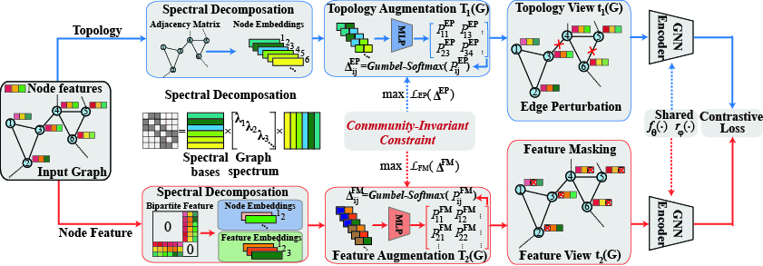

<h1 align="center"> <p>CI-GCL</p></h1>
<h3 align="center">
    <p>Community-Invariant Graph Contrastive Learning" (CI-GCL)</p>
</h3>




This is the code for "Community-Invariant Graph Contrastive Learning" (CI-GCL).
CI-GCL adopt learnable data augmentation with Community-Invariant constraint on both topology and features. 
And all these parts are jointly optimized to make sure the augmentation schemes can benefit from contrastive loss, CI constraints and downstream classifiers (semi-supervised).

## Requirement

Code is tested in **Python 3.10.13**. Some major requirements are listed below:
```bash
pip install torch==2.1.0 torchvision==0.16.0 torchaudio==2.1.0 --index-url https://download.pytorch.org/whl/cu118
pip install torch_geometric
pip install pyg_lib torch_scatter torch_sparse torch_cluster torch_spline_conv -f https://data.pyg.org/whl/torch-2.1.0+cu118.html
pip install dgl
pip install networkx
pip install tqdm tabulate
pip install scipy
pip install scikit-learn
```

> [!TIP]
> Since we modify the framework of PyGCL, please do not include the PyGCL package in your enviroment.


## Run the code

For different graph-level tasks, we provides:

### Launch graph classification in unsupervised setting
```python
python graph_classification.py --dataset_name ${dataset_name} --gpu ${gpu}
```

\${dataset_name} is the dataset name (please refer to [TU dataset](https://chrsmrrs.github.io/datasets/docs/datasets/)), \${gpu} is the lanched GPU ID


### Launch graph classification in semi-supervised setting
First pretrain the dataset
```python
python graph_classification_semi_pretrain.py --dataset_name ${dataset_name}
```
Then, finetune it
```python
python graph_classification_semi_finetune.py --dataset_name ${dataset_name}
```


### Launch graph classification in transfer learning setting

```python
python graph_transfer_pretrain_and_finetune.py --dataset_name ${dataset_name} --ft_dataset ${ft_dataset}
```
where \${dataset_name} is the pretrain dataset, and \${ft_dataset} is the finetune dataset


> [!TIP]
> For transfer learning, please refer to [pretrain-gnns](https://github.com/snap-stanford/pretrain-gnns) for environment setup and dataset download.

> [!TIP]
> When you can't manage to install the old torch-geometric versions, or you can't load the old datasets from "pretrain-gnns", you could install a new torch-geometric version and make modification based on [pytorch_geometric](https://github.com/pyg-team/pytorch_geometric/discussions/4502) (And the issue in [pretrain-gnns](https://github.com/snap-stanford/pretrain-gnns/issues/14) could help either).


### Launch the robustness of the pretrained encoder
We randomly drop and add [0.05, 0.1, 0.15, 0.2, 0.25, 0.3] edges in topology robustness test.
And randomly add gaussian noise to [0.05, 0.1, 0.15, 0.2, 0.25, 0.3] positions in feature robustness test.
```
python robustness_check.py --dataset_name ${dataset_name}
python robustness_check_feature.py --dataset_name ${dataset_name}
```
